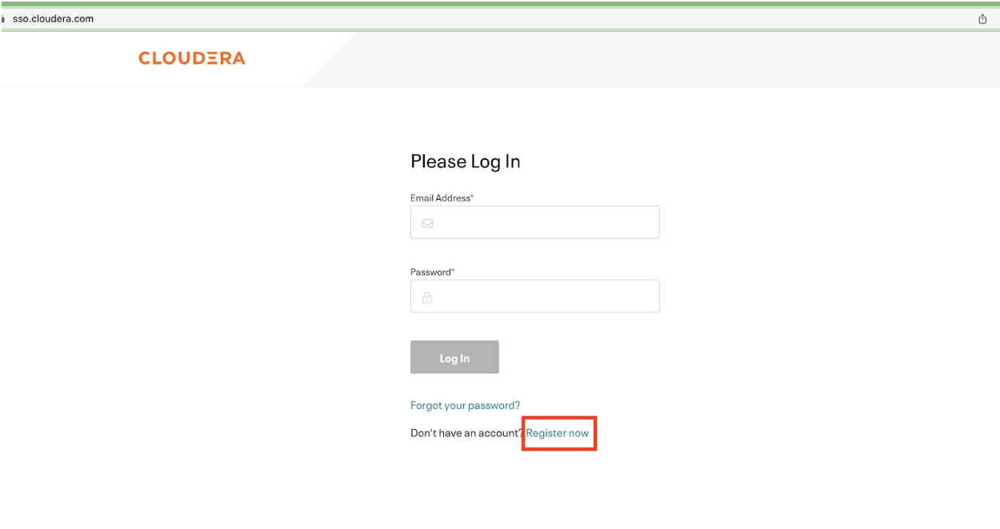
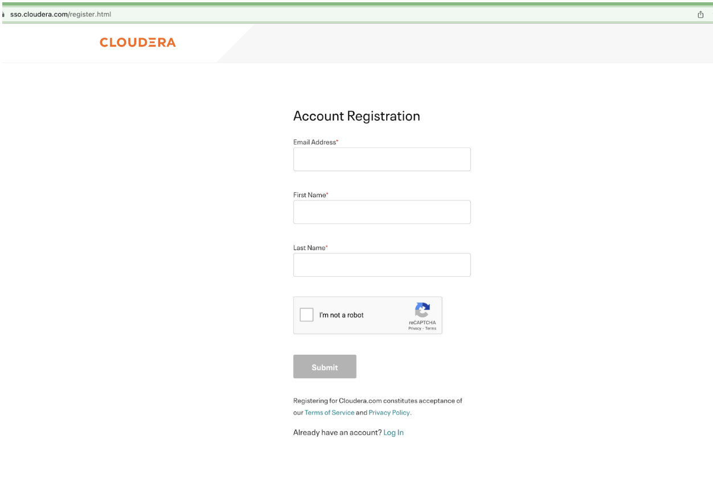
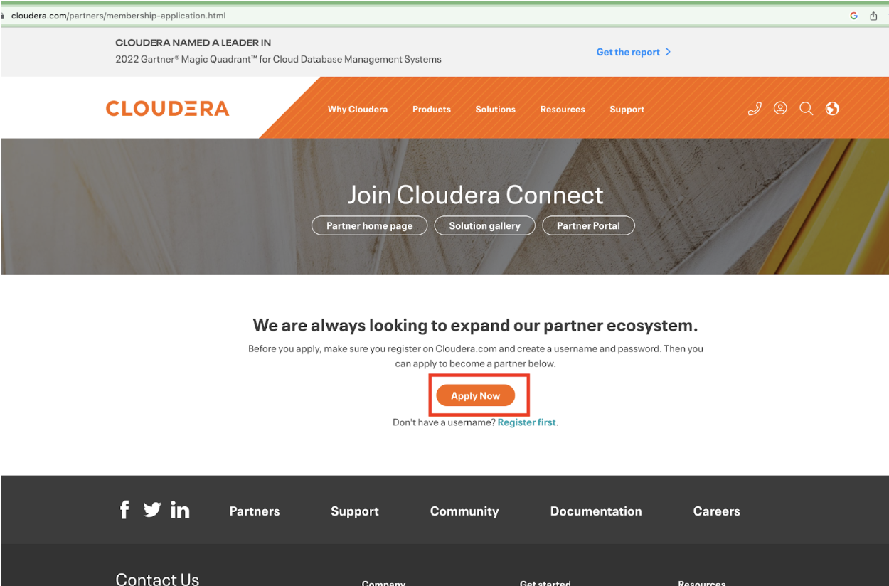

= CDP Certification Process
Puneet Joshi <puneetjoshi@cloudera.com>; Pannag Katti <pkatti@cloudera.com>

1.0, Feb 22, 2023

This document provides the details for Partners who are willing to integrate and validate their product (ISV) and hardware (IHV) on Cloudera Data Platform(CDP). Cloudera Data Platform  is a single platform that has two form factors CDP Public and CDP Private cloud. 

== Introduction

*CDP Public Cloud* is an integrated analytics and data management platform deployed on *cloud services*. It consists of a number of cloud services designed to address specific enterprise data cloud use cases.
This includes Data Hub powered by Cloudera Runtime, self-service experiences (Data Warehouse, Machine Learning, and Data Engineering) running on containers, the administrative layer (Management Console), and SDX services (Data Lake, Data Catalog, Replication Manager, and Workload Manager).

*CDP Private Cloud* is an integrated analytics and data management platform deployed in *private data centers*. It consists of CDP Private Cloud Base and CDP Private Cloud Data Services and offers broad data analytics and artificial intelligence functionality along with secure user access and data governance features.

---

This document outlines the steps to validate/integrate on CDP for,

* Independent Software Vendors *(ISV)* Partners who are willing to integrate their software products and validate it on any one of the CDP form factors or on both. 

* Independent Hardware Vendors *(IHV)* Partners who are willing to validate and test CDP Private Cloud form factor on their hardware. 

== Register on Cloudera SSO

_(*Skip the below steps if you are already registered on Cloudera SSO.*)_

[.underline]*Step1:* Register yourself and your team members who will be working on this certification engagement in Cloudera SSO by accessing the below URL.

https://sso.cloudera.com/

NOTE: Make sure registration is done by using an official email id.

[.underline]*Step 2:* An activation code will be sent over the email. Please verify each registered email id by following the steps mentioned in that email.

[.underline]*Step 3:* After verification of the email id, you will be redirected to profile creation page. Please submit the required details to  complete the *SSO* account creation.

== Register on Cloudera Partner Portal

[.underline]*Step1:* Please submit the form available at below URL. 

https://www.cloudera.com/partners/membership-application.html

_If prompted, login with your Cloudera SSO account._

[.underline]*Step 2:* Select the Primary Line Of Business field. 

* If you are an **ISV Partner** select “Software Vendor/ISV” in the Primary Line Of Business field. 

image::images/Select_ISV.png[]

* If you are an **IHV Partner** select “Hardware Vendor/IHV” in the Primary Line Of Business field. 

image::images/Select_IHV.png[]

[.underline]*Step 3:* Submit the application.

Once the above application is approved you will be notified over the email containing the URL to access the *Partner Portal*.

== Request For Development License

== For ISV Partners

=== Submit ISV Certification Request

=== ISV Product Integration

=== Post Integration

=== Post Certification of ISV Product

== For IHV Partners

=== Validation Tests

=== Post Validation of IHV Setup

== Appendix

.Image caption
image::image-file-name.png[I am the image alt text.]
This is a paragraph with a *bold* word and an _italicized_ word.